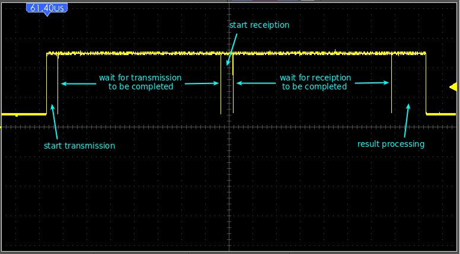
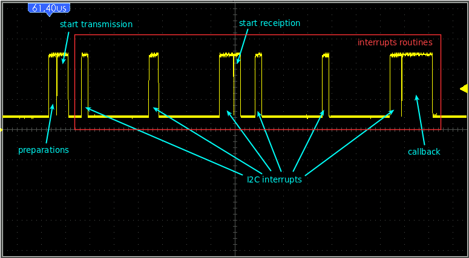

# AVR universal non-blocking driver for DS3231 RTC #

## Dependencies ##

* [avr-misc library](https://github.com/specadmin/avr-misc)
* [avr-twi driver](https://github.com/specadmin/avr-twi)

## Requirements ##

* [AVR MCU](https://www.microchip.com/design-centers/8-bit/avr-mcus)
* [GNU AVR C compiller (avr-gcc)](https://gcc.gnu.org/wiki/avr-gcc)
* [AVR Libc library](https://nongnu.org/avr-libc)
* All libraries' and drivers' folders should be placed in the same directory.

## Synchronous or asyncronous? ##

Some methods, provided by this library may be called in two ways: synchronously (blocking) and asynchronously (non-blocking).

| Synchronous (blocking) call  | Asynchronous (non-blocking) call |
| --- | --- |
| Synchronous (blocking) method call waits untill all the communication process will be completed and returns only after that. | In asyncronous (non-blocking) calls the following method returns immediately after starting the communication process. All futher communication routines will be automatically processed in interrupts. After the communication process will be completed or in case of error the callback function will be called. |
|||
| **WARNINIG** Library's blocking methods **must not be called** from interrupts routines. In case of blocking call from an interrupt routine it will hang up and never return. | Non-blocking methods can be called from any interrupt routine |

**WARNING** Global interrupt flag should be enabled (set) during the communication in blocking and non-blocking calls both. Clearing of this flag will suspend the communication and may cause program's hang-ups in blocking calls.

## BCD or decimal? ##

BCD (binary-coded decimal) -- a format of decimal numbers where each decimal digit is represented by four bits.

This library provides taking the time from RTC in two formats: BCD or decimal. Library's methods, that return values in BCD format, have `_bcd` suffix in their names.

AVR microcontrollers are unable to proceed calculations with BCD-formated numbers. However, if you only want to convert those values into ASCII-codes in order to display the time somewhere in your application, then BCD format is more preferable, since it takes less time for conversion into "printable" formats. If you need to proceed any futher calculations with time (add, substact, compare, etc), then you ought to use decimal-formatted methods. Also BCD format is more comfortable in debugging, since it's HEX dump looks exactly like decimal numbers.

## Sample project ##

Sample project included. See the [sample](https://github.com/specadmin/DS3231/tree/master/sample) directory for details.

## Methods description ##

To be continued...
